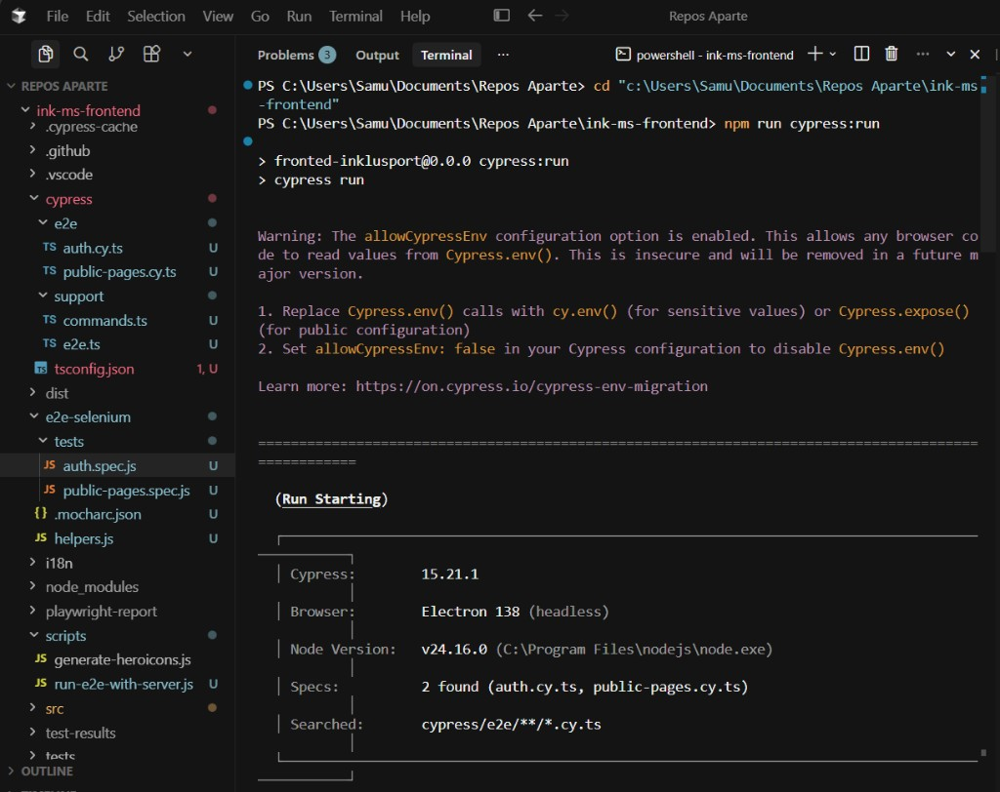
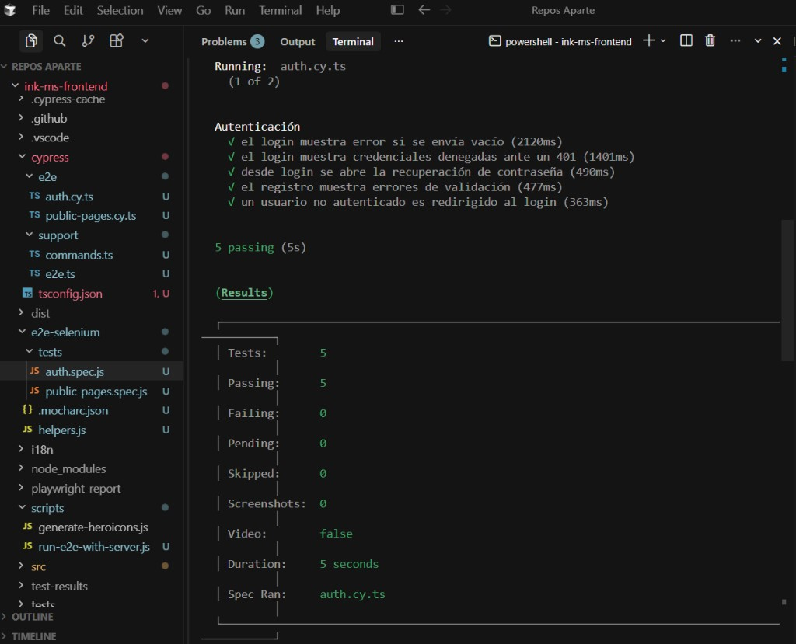
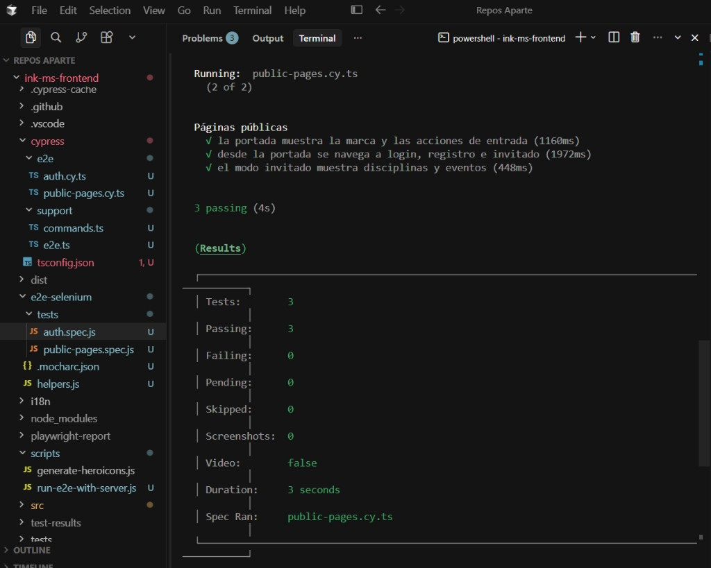
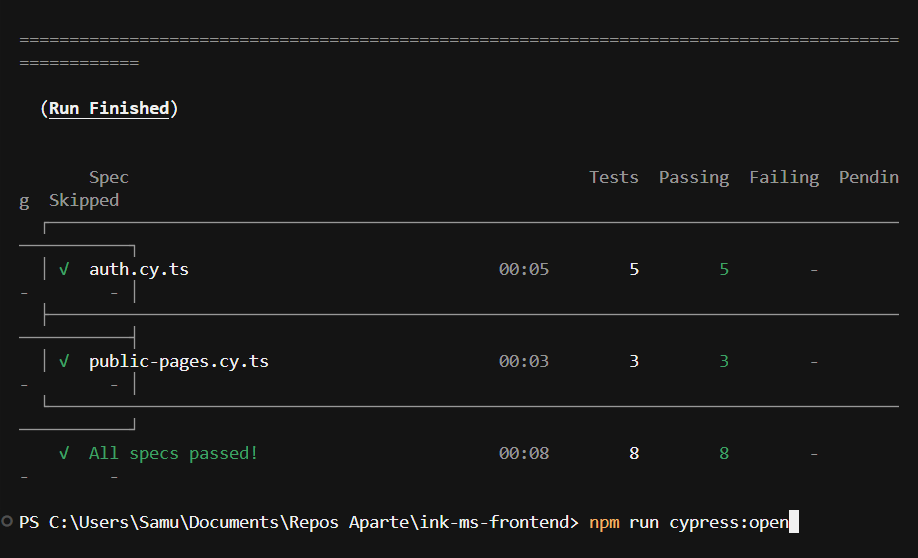

# Pruebas E2E con Cypress

Suite de pruebas end-to-end del frontend de Inklusport usando **Cypress**. Cubre los mismos flujos que Selenium: portada, navegación, modo invitado, validación de login/registro, credenciales denegadas (401) y la redirección al login si no hay sesión.

## Requisitos

- Node.js
- Dependencias del frontend (`npm install` en `ink-ms-frontend`)
- Binario de Cypress (solo la primera vez)

```powershell
npm run cypress:install
```

Si `cypress install` se queda en `Unzipping Cypress 0%`, hace falta Cypress **15.16 o superior** (este proyecto usa 15.21.1). En Node 24.16.0 las versiones 13.x se cuelgan al extraer el zip.

## Cómo ejecutarlas

Desde `ink-ms-frontend`, con arranque automático de `ng serve`:

```powershell
npm run e2e:cypress
```

Runner interactivo (time-travel, clics, recarga de specs):

```powershell
npm run e2e:cypress:open
```

Si el frontend ya está en `http://localhost:4200`:

```powershell
npm run cypress:run
npm run cypress:open
```

## Specs

| Archivo | Qué cubre |
|---------|-----------|
| `e2e/auth.cy.ts` | Login vacío, 401, recuperación de contraseña, validación de registro, guard de `/home` |
| `e2e/public-pages.cy.ts` | Portada, navegación a login/registro/invitado, disciplinas y eventos |

Configuración: `../cypress.config.ts`. Comandos compartidos: `support/commands.ts`.

## Resultado de una ejecución

`npm run cypress:run` arranca Cypress 15.21.1 en Electron headless:



`auth.cy.ts` — **5 passing**:



`public-pages.cy.ts` — **3 passing**:



Resumen final: **All specs passed** (8/8):


