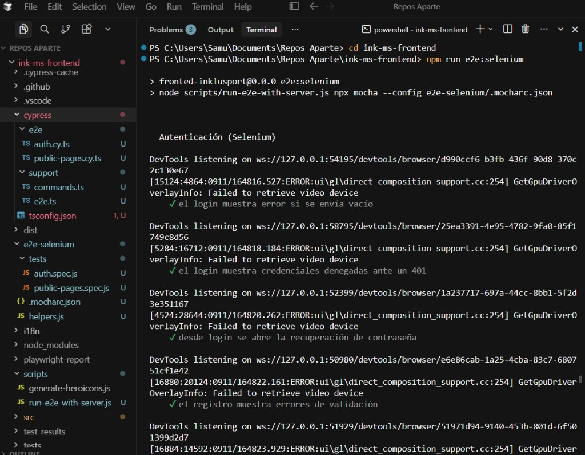
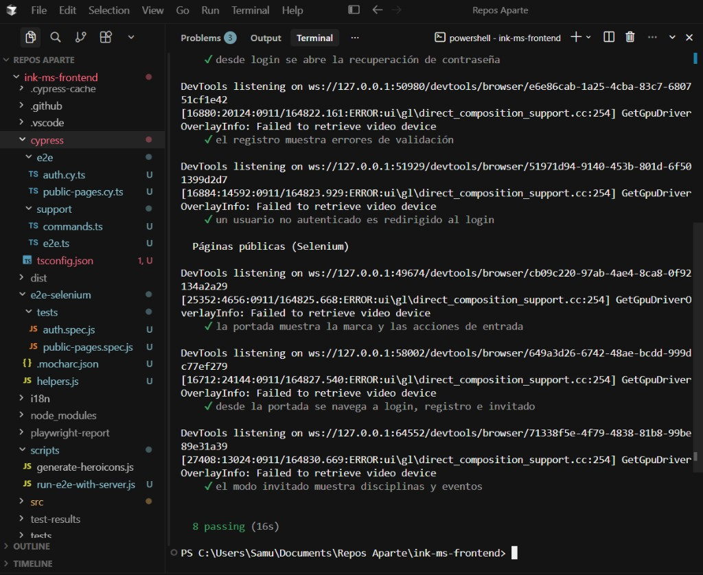

# Pruebas E2E con Selenium

Suite de pruebas end-to-end del frontend de Inklusport usando **Selenium WebDriver**, **Mocha** y **Chrome**. Cubre portada, navegación, modo invitado, validación de login/registro, credenciales denegadas (401) y la redirección al login si no hay sesión.

## Requisitos

- Node.js
- Google Chrome
- Dependencias del frontend (`npm install` en `ink-ms-frontend`)

El ChromeDriver lo descarga Selenium Manager de forma automática.

## Cómo ejecutarlas

Desde `ink-ms-frontend`:

```powershell
npm run e2e:selenium
```

Ese comando levanta `ng serve` en `http://localhost:4200` si aún no está en marcha y luego corre Mocha.

Si el frontend ya está levantado:

```powershell
npm run e2e:selenium:run
```

Para ver el navegador (no headless):

```powershell
$env:SELENIUM_HEADED="1"
npm run e2e:selenium
```

## Specs

| Archivo | Qué cubre |
|---------|-----------|
| `tests/auth.spec.js` | Login vacío, 401, recuperación de contraseña, validación de registro, guard de `/home` |
| `tests/public-pages.spec.js` | Portada, navegación a login/registro/invitado, disciplinas y eventos |

Helpers compartidos: `helpers.js`. Configuración de Mocha: `.mocharc.json`.

## Resultado de una ejecución

`npm run e2e:selenium` — suite de autenticación en curso:



Las líneas `Failed to retrieve video device` y `GetGpuDriverOverlayInfo` las imprime Chrome en headless. **No hacen fallar las pruebas.**

Suite completa en verde (**8 passing**):


